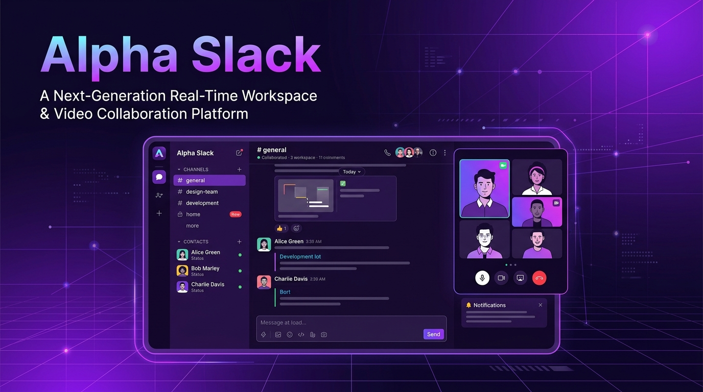
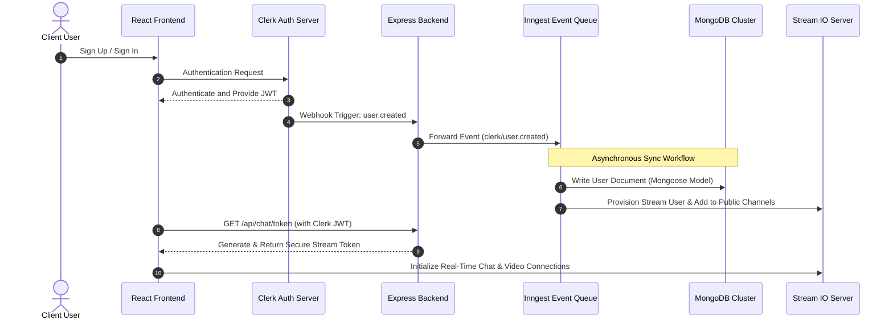

# 🚀 Alpha Slack — Real-Time Workspace & Video Collaboration Platform

Alpha Slack is an enterprise-grade, high-performance real-time messaging and video conferencing platform modeled after Slack. Designed with a modern dark theme and powered by a robust event-driven architecture, it connects standard chat and calling services with background job queues, secure authentication syncs, and comprehensive telemetry.

---

### 🌟 Project Badges & Stack Overview

[](https://react.dev/)
[](https://tailwindcss.com/)
[](https://expressjs.com/)
[](https://www.mongodb.com/)
[](https://clerk.com/)
[](https://getstream.io/)
[](https://www.inngest.com/)
[](https://sentry.io/)

---

## ⚡ Key Highlights & Core Features

*   💬 **Real-Time Communication**: Support for multi-channel messaging threads, direct messaging, user presence tracking, live typing indicators, read receipts, and message reactions powered by the **Stream Chat React SDK**.
*   🎥 **Video & Audio Calling Rooms**: Seamless, multi-peer video/audio conference rooms with active speaker layouts, participant lists, screen sharing, and media controls powered by the **Stream Video React SDK**.
*   🔐 **Secure User Management**: Dynamic, token-based session management using **Clerk** authentication.
*   🔄 **Event-Driven User Onboarding**: Dynamic synchronization loop triggered by Clerk Webhooks to create, update, or remove users from the MongoDB cluster and the Stream Chat/Video engines. Powered asynchronously by **Inngest** background workflows.
*   📊 **Full-Stack Telemetry**: Performance monitoring, API latency logs, error tracking, and exception reporting across frontend React code and backend Express routes using **Sentry**.
*   ✨ **Premium Aesthetics**: Sleek dark-mode theme designed with Tailwind CSS v4 and modular CSS layouts, featuring glassmorphism elements, custom modals (for channel creation and user invitations), search filters, and smooth micro-animations.

---

## 🏗️ Architectural Flow & Webhook Sync

The following diagram illustrates how user onboarding works in Alpha Slack: Clerk handles the initial sign-up, fires a webhook, Inngest intercepts it to run background synchronizations, and the client uses secure tokens generated on-the-fly to connect to real-time chat and video channels.



---

## 🛠️ Technology Stack Breakdown

| Technology Layer | Tool / Library | Purpose & Rationale |
| :--- | :--- | :--- |
| **Frontend** | [React 19](https://react.dev/) | Utilizes React 19's virtual DOM, modern hooks, and state management rules for high-performance rendering. |
| **Frontend Router** | [React Router v7](https://reactrouter.com/) | Client-side routing, route guards, and layouts with Sentry telemetry integration. |
| **Frontend Bundler** | [Vite 7](https://vite.dev/) | Lightning-fast development server with Hot Module Replacement (HMR) and optimized build systems. |
| **Styling Engine** | [Tailwind CSS v4](https://tailwindcss.com/) | Utilizes css-first configurations, CSS-native imports, and theme tokens for responsive layout control. |
| **Backend Framework** | [Express 5](https://expressjs.com/) | Micro-framework handling HTTP routing, lazy database connection wrappers, and middleware services. |
| **Database** | [MongoDB & Mongoose](https://mongoosejs.com/) | Document store storing user metadata, configured with schemas and model hooks. |
| **Background Jobs** | [Inngest SDK](https://inngest.com/) | Durable event-driven queues, retries, and background synchronization functions. |
| **Auth Provider** | [Clerk Express SDK](https://clerk.com/) | Secure identity verification, multi-session cookies, and user object properties. |
| **Real-time Engine** | [Stream Chat & Video SDKs](https://getstream.io/) | Enterprise-grade WebSockets and WebRTC channels managing message syncs and multi-peer video links. |
| **Observability** | [Sentry SDKs](https://sentry.io/) | Full-stack telemetry logging client-side crashes, API timeouts, and uncaught backend exceptions. |

---

## 📂 Project Structure

This workspace is structured as a monorepo consisting of two primary packages:

```
alpha_slack/
├── backend/
│   ├── api/                     # Vercel serverless functions deployment targets
│   ├── src/
│   │   ├── config/              # Inngest, Mongoose database, Stream & Env configs
│   │   ├── controllers/         # Chat and token controllers
│   │   ├── middleware/          # Clerk validation and DB connection middlewares
│   │   ├── models/              # Mongoose user model definitions
│   │   ├── routes/              # Express API endpoints
│   │   └── server.js            # Main Express application entry point
│   ├── package.json
│   └── vercel.json              # Serverless configuration for backend hosting
├── frontend/
│   ├── src/
│   │   ├── components/          # Reusable UI widgets (Modals, Headers, Previews)
│   │   ├── hooks/               # Custom React hooks (Stream Chat integration)
│   │   ├── lib/                 # Axios API configuration
│   │   ├── pages/               # Main Page Views (HomePage, CallPage, AuthPage)
│   │   ├── providers/           # Context providers
│   │   ├── styles/              # Global stylesheet overrides
│   │   └── App.jsx              # Main routing and application layout
│   ├── package.json
│   └── vercel.json              # Serverless configuration for SPA hosting
├── assets/
│   └── banner.jpg               # Project branding graphic
└── README.md                    # Root project documentation
```

---

## 🚀 Local Installation & Setup Guide

To run Alpha Slack on your machine, follow this step-by-step guide.

### 📋 Prerequisites

Before starting, ensure you have:
*   [Node.js](https://nodejs.org/) installed (v18 or higher recommended).
*   A running [MongoDB Atlas](https://www.mongodb.com/cloud/atlas) cluster or local MongoDB instance.
*   A [Clerk](https://clerk.com/) developer account.
*   A [GetStream](https://getstream.io/) developer account.
*   An [Inngest Cloud](https://www.inngest.com/) account (or run the local Inngest development server).

---

### Step 1: Environment Variables Configuration

To run the application, copy the example configurations and populate them with your credentials.

1.  **Backend Configuration**:
    Navigate to the `backend` folder, copy the example file, and update the values:
    ```bash
    cd backend
    cp .env.example .env
    ```
    Configure the variables in the newly created [backend/.env](file:///c:/Users/hv702/Downloads/Slack/backend/.env) file (see [backend/.env.example](file:///c:/Users/hv702/Downloads/Slack/backend/.env.example) for structure).

2.  **Frontend Configuration**:
    Navigate to the `frontend` folder, copy the example file, and update the values:
    ```bash
    cd ../frontend
    cp .env.example .env
    ```
    Configure the variables in the newly created [frontend/.env](file:///c:/Users/hv702/Downloads/Slack/frontend/.env) file (see [frontend/.env.example](file:///c:/Users/hv702/Downloads/Slack/frontend/.env.example) for structure).

---

### Step 2: Install Dependencies

Run the package installers in both folders:

1.  **Install Backend dependencies**:
    ```bash
    cd ../backend
    npm install
    ```

2.  **Install Frontend dependencies**:
    ```bash
    cd ../frontend
    npm install
    ```

---

### Step 3: Run the Inngest Local Dev Server

Inngest requires a daemon to monitor event queues and dispatch background functions. Run the local Inngest Dev Server pointing to your backend endpoint:

```bash
# In your terminal, start the Inngest Dev Server (it polls backend/api/inngest)
npx inngest-cli@latest dev -u http://localhost:5001/api/inngest
```

Open the Inngest dashboard at [http://localhost:8288](http://localhost:8288) to monitor background events and replay workflows.

---

### Step 4: Configure Webhooks (Optional for Local Sync)

To receive webhooks locally from Clerk:
1.  Expose your local backend server port (`5001`) to the internet using **ngrok**:
    ```bash
    ngrok http 5001
    ```
2.  Copy the generated forwarding URL (e.g., `https://random-subdomain.ngrok-free.app`).
3.  Go to the **Clerk Dashboard -> Webhooks -> Add Endpoint**.
4.  Paste the URL and append `/api/inngest`: `https://random-subdomain.ngrok-free.app/api/inngest`.
5.  Select `user.created` and `user.deleted` as subscription events.
6.  For local testing without webhooks, you can manually trigger events through the Inngest Dev Dashboard at [http://localhost:8288/sending](http://localhost:8288/sending).

---

### Step 5: Start the Development Servers

With all configuration steps complete, boot both servers in separate terminal instances:

1.  **Start Backend**:
    ```bash
    cd backend
    npm run dev
    ```
    *Starts the Express server on port `5001` with nodemon and Sentry instrumentation.*

2.  **Start Frontend**:
    ```bash
    cd frontend
    npm run dev
    ```
    *Starts the Vite dev server on port `5173`.*

Open your web browser and navigate to [http://localhost:5173](http://localhost:5173).

---

## ⚡ Production Deployment (Vercel)

Both frontend and backend are configured for simple serverless deployment on Vercel:

1.  **Backend Deployment**:
    *   Deploy the backend using the Vercel CLI:
        ```bash
        cd backend
        vercel
        ```
    *   Ensure all backend environment variables (`MONGO_URI`, `CLERK_SECRET_KEY`, `STREAM_API_SECRET`, etc.) are configured in your Vercel Project Settings.

2.  **Frontend Deployment**:
    *   Deploy the frontend:
        ```bash
        cd frontend
        vercel
        ```
    *   Set the variables in the Vercel Settings, pointing `VITE_API_BASE_URL` to your live backend endpoint.

---

## 🔒 Security Practices & Implementation Quality

*   **Credential Segregation**: All secrets are loaded through a structured [backend/src/config/env.js](file:///c:/Users/hv702/Downloads/Slack/backend/src/config/env.js) validation layer, ensuring zero credential leaks into source code.
*   **Lazy Database Connections**: The database handler uses a lazy-loading connection middleware in Express, which avoids keeping idle sockets open and prevents cluster timeouts on serverless runtimes.
*   **Secure token exchange**: The client requests a limited-permission JWT token from GetStream generated on the backend using the authenticated Clerk user ID, preventing client-side secret leakage.
*   **Dynamic CORS validation**: The backend dynamically validates requests against an array of trusted client domains while securely handling credentials, making it robust against cross-origin scripting attacks.
